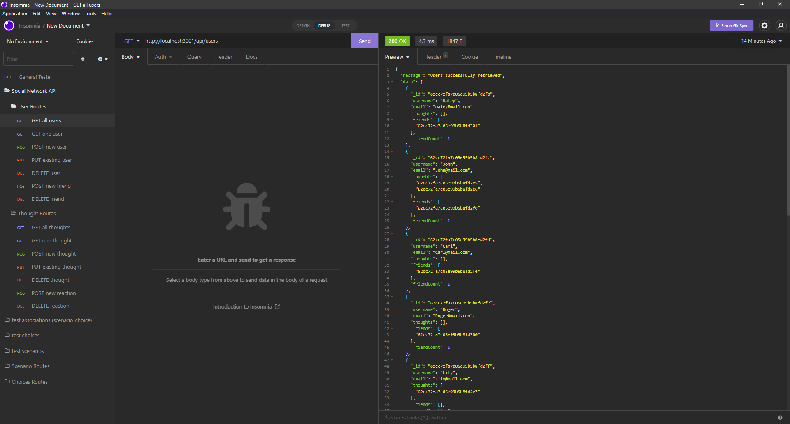
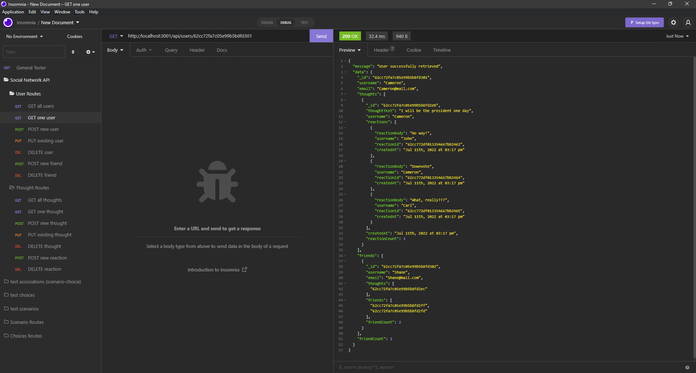
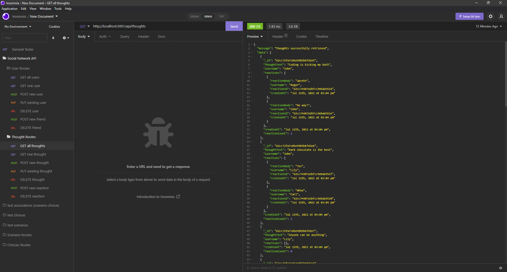

# Social Network API

 

## Description

- My motivation behind this project was to utilize what I've learned about noSQL, specifically MongoDB, to create a backend application that can implement all CRUD functionality. 
- I built this project to better understand noSQL, MongoDB, Mongoose, and how non-relational databases differ from relational databases.
- This project aims to create the back-end for an application that interacts with a database through Insomnia.
- Through this project, I learned more about noSQL, MongoDB, Mongoose, routing, seeding of MongoDB data, and the data structure that non-relational databases provide.

## Table of Contents

1. [Installation](#installation)
2. [Usage](#usage)
3. [Video Demonstration](#video)
4. [License](#license)
5. [How to Contribute](#how-to-contribute)
6. [Questions?](#questions)

## Installation

**Note**: This application requires the use of [Node.js](https://nodejs.org/en/) and [MongoDB](https://www.mongodb.com/)

To install this project, you first need to clone this repo. To install dependencies, open in [Visual Studio Code](https://code.visualstudio.com/), and in the terminal run: 

    npm install 

Alternatively, you can navigate to the application's installation location in [Git Bash](https://git-scm.com/downloads) (or similar command-line tool) and do the same.

You can seed the database using test data I created by opening the terminal and running:

    npm run seed

## Usage

Once this project is opened in Visual Studio Code, or navigated to using Git Bash (or similar command-line tool), run: 

    npm start 

The root route for this application is `http://localhost:3001`, but you can change the port number in the `server.js` file.

Open up [Insomnia](https://insomnia.rest/), or similar program, and use the following routes to interact with the database:

- `http://localhost:3001/api/users`
- `http://localhost:3001/api/users/:userId`
- `http://localhost:3001/api/users/:userId/friends/:friendId`
- `http://localhost:3001/api/thoughts`
- `http://localhost:3001/api/thoughts/:thoughtId`
- `http://localhost:3001/api/thoughts/:thoughtId/reactions/`
- `http://localhost:3001/api/thoughts/:thoughtId/reactions/:reactionId`

## Video Demonstration

The full video demonstration can be found [here](https://drive.google.com/file/d/1XpxyX2NZ8dj7G0BUOlKj6PkDDSm8HRWg/view)

## License

This application is covered under the [MIT](https://opensource.org/licenses/MIT) license

----------------------------------------------------------------

  Copyright © 2022 Richard Zhang

  Permission is hereby granted, free of charge, to any person obtaining a copy of this software and associated documentation files (the "Software"), to deal in the Software without restriction, including without limitation the rights to use, copy, modify, merge, publish, distribute, sublicense, and/or sell copies of the Software, and to permit persons to whom the Software is furnished to do so, subject to the following conditions:
  
  The above copyright notice and this permission notice shall be included in all copies or substantial portions of the Software.
  
  THE SOFTWARE IS PROVIDED "AS IS", WITHOUT WARRANTY OF ANY KIND, EXPRESS OR IMPLIED, INCLUDING BUT NOT LIMITED TO THE WARRANTIES OF MERCHANTABILITY, FITNESS FOR A PARTICULAR PURPOSE AND NONINFRINGEMENT. IN NO EVENT SHALL THE AUTHORS OR COPYRIGHT HOLDERS BE LIABLE FOR ANY CLAIM, DAMAGES OR OTHER LIABILITY, WHETHER IN AN ACTION OF CONTRACT, TORT OR OTHERWISE, ARISING FROM, OUT OF OR IN CONNECTION WITH THE SOFTWARE OR THE USE OR OTHER DEALINGS IN THE SOFTWARE.

  ----------------------------------------------------------------

## How to Contribute

If you want to contribute to this project and make it better, your help is very welcome. This was a school project, so anything you want to do to it, go for it. You can also contact me directly through the links below.

## Questions?

Have any questions? Here is a list of my links:
- GitHub: [RichardZhang01](https://github.com/RichardZhang01)
- Email: richardzhiyuanzhang@gmail.com

